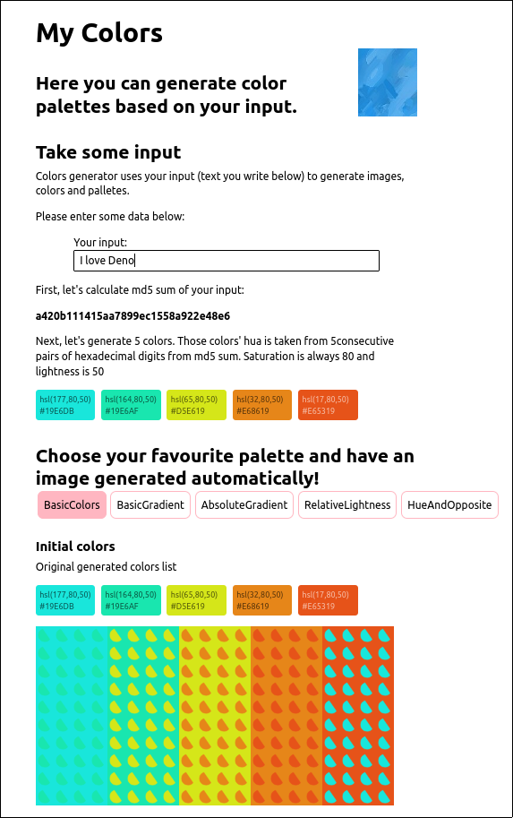

# What is it
Another excercise to use React and Deno.
This time I try to generate color palettes.
The credit goes to KolorWheel.js and Deno std library.

What I learned:

* how to use useRef, useEffect (for canvas context re-generation on each prop change)
* that Map's keys() or values() need to be made into arrays (using Array.from) before functional api (map, forEach, filter) can be used on them
* that using string literals alternative as a Typescript type is a very good idea
* that it is hard to pass state to child elements so I eventually kept state on top-level and used it in non-child

# Screenshot

